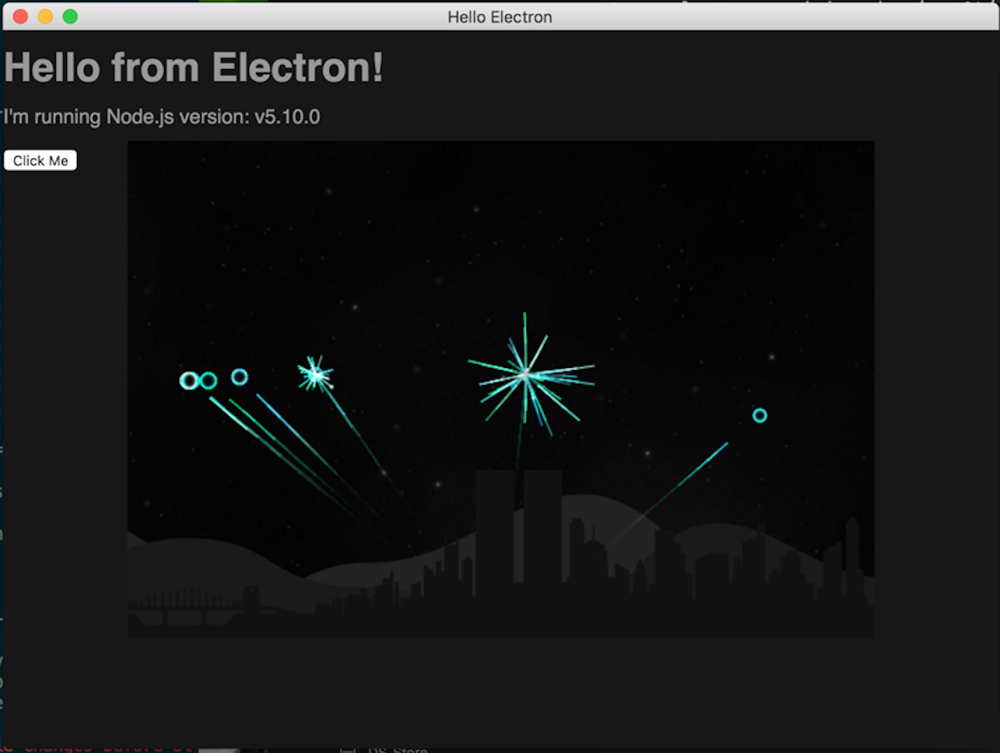

# electron-workshop

An electron workshop from JSConf 2016

## Setup
`npm i`

## Run
`npm start`

## Build project and generate executable
```js
// Mac
npm run osx
// Windows
npm run win64
npm run win32
// Linux
npm run linux
```



